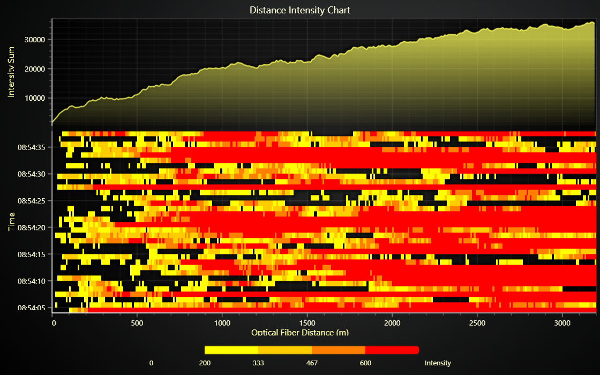

# JavaScript Distance Intensity Chart

This demo application belongs to the set of examples for LightningChart JS, data visualization library for JavaScript.

LightningChart JS is entirely GPU accelerated and performance optimized charting library for presenting massive amounts of data. It offers an easy way of creating sophisticated and interactive charts and adding them to your website or web application.

The demo can be used as an example or a seed project. Local execution requires the following steps:

-   Make sure that relevant version of [Node.js](https://nodejs.org/en/download/) is installed
-   Open the project folder in a terminal:

          npm install              # fetches dependencies
          npm start                # builds an application and starts the development server

-   The application is available at _http://localhost:8080_ in your browser, webpack-dev-server provides hot reload functionality.

## Description

This example is based on a real life usage scenario of _LightningChart JS_ in the field of **Fiber Analysis**.

_Fiber Analysis_ refers to the assessment of fiber quality to analyze attenuation and other fiber optic performance metrics during single point of time or across a time period.

This example showcases an example dashboard for analyzing fiber properties over a short time period (~30 seconds).

The metrics are gathered at several locations across the fiber to help spot problem locations (total fibre length is more than 3 kilometers).

The primary metric, _intensity_, is recorded for each location along fibre (meters) and for various time steps. The _intensity_ value is _abstract_, meaning that it could reflect many different values for different analysis purposes. A common property in fiber metrics to analyse is _Attenuation_.

The color of each sample is colored in a _heat map grid series_ based on a color lookup table, which makes identifying _hot spots_ convenient (for example, orange is bad, blue is ok).

The data used in the example is randomly generated each time the example is run.

## API Links

* [LightningChart]
* [Chart XY]
* [Axis XY]
* [Area Series]
* [Heatmap Grid Series]
* [UI LUT range]
* [UI Element]
* [Axis Tick strategies]
* [Area series types]
* [Color factory RGBA]
* [Paletted fill style]
* [Color lookup table]
* [Empty line style]
* [Empty fill style]
* [Empty tick style]
* [UI element builders]
* [UI origins]

## Support

If you notice an error in the example code, please open an issue on [GitHub][0] repository of the entire example.

Official [API documentation][1] can be found on [LightningChart][2] website.

If the docs and other materials do not solve your problem as well as implementation help is needed, ask on [StackOverflow][3] (tagged lightningchart).

If you think you found a bug in the LightningChart JavaScript library, please contact support@lightningchart.com.

Direct developer email support can be purchased through a [Support Plan][4] or by contacting sales@lightningchart.com.

[0]: https://github.com/Arction/
[1]: https://lightningchart.com/lightningchart-js-api-documentation/
[2]: https://lightningchart.com
[3]: https://stackoverflow.com/questions/tagged/lightningchart
[4]: https://lightningchart.com/support-services/

© LightningChart Ltd 2009-2022. All rights reserved.

[LightningChart]: https://lightningchart.com/js-charts/api-documentation/v4.2.0/functions/lightningChart-1.html
[Chart XY]: https://lightningchart.com/js-charts/api-documentation/v4.2.0/classes/ChartXY.html
[Axis XY]: https://lightningchart.com/js-charts/api-documentation/v4.2.0/classes/Axis.html
[Area Series]: https://lightningchart.com/js-charts/api-documentation/v4.2.0/classes/AreaSeriesPositive.html
[Heatmap Grid Series]: https://lightningchart.com/js-charts/api-documentation/v4.2.0/classes/HeatmapGridSeriesIntensityValues.html
[UI LUT range]: https://lightningchart.com/js-charts/api-documentation/v4.2.0/interfaces/UILUTRange.html
[UI Element]: https://lightningchart.com/js-charts/api-documentation/v4.2.0/interfaces/UIElement.html
[Axis Tick strategies]: https://lightningchart.com/js-charts/api-documentation/v4.2.0/variables/AxisTickStrategies.html
[Area series types]: https://lightningchart.com/js-charts/api-documentation/v4.2.0/AreaSeriesTypes.html
[Color factory RGBA]: https://lightningchart.com/js-charts/api-documentation/v4.2.0/functions/ColorRGBA.html
[Paletted fill style]: https://lightningchart.com/js-charts/api-documentation/v4.2.0/classes/PalettedFill.html
[Color lookup table]: https://lightningchart.com/js-charts/api-documentation/v4.2.0/classes/LUT.html
[Empty line style]: https://lightningchart.com/js-charts/api-documentation/v4.2.0/variables/emptyLine.html
[Empty fill style]: https://lightningchart.com/js-charts/api-documentation/v4.2.0/variables/emptyFill-1.html
[Empty tick style]: https://lightningchart.com/js-charts/api-documentation/v4.2.0/variables/emptyTick.html
[UI element builders]: https://lightningchart.com/js-charts/api-documentation/v4.2.0/variables/UIElementBuilders.html
[UI origins]: https://lightningchart.com/js-charts/api-documentation/v4.2.0/variables/UIOrigins.html

